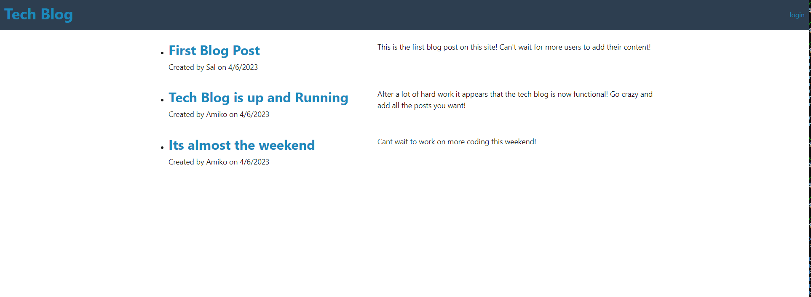
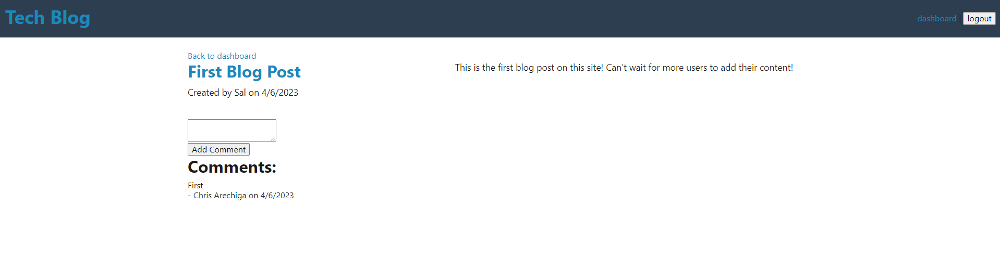

# MVC-Tech-Blog  	

## Description

In order to keep up to date on the going's on of tech users, the tech blog is a place for users to post about their experiences with tech and up to date news
This project was started as a way to learn the Model-View-Controller architecture and how it works with express to post, get, put, and delete data from a persistant database

In order to get the application functional, it was necessary to learn the ins and outs of handlebars and sess variables to keep users logged in to their account to post

## Table of Contents

- [MVC-Tech-Blog  	](#mvc-tech-blog--)
  - [Description](#description)
  - [Table of Contents](#table-of-contents)
  - [Installation](#installation)
  - [Usage](#usage)
  - [Credits](#credits)
  - [License](#license)
  - [Tests](#tests)
  - [Questions](#questions)

## Installation

In order to install the dependencies you can run the npm i command, you will also need to source the schema.sql file to get the database running. all the required dependencies are already located in the package.json file

## Usage

In order to use this application you first need to create an account by entering your name your email and a password and you will automatically be logged in and taken to your dashboard where you  will have the option to make your own posts. Once you have some posts to your account they will be listed on your dashboard page and you can click the edit link to let you edit or delete posts. To view other user's posts you just need to cloick the "Tech Blog" home linkk, which will take you to the home page that displays the most recent posts. Simply clicking on a post will direct you to a page where you can interact with it by leaving comments. 

## Credits

## License

This application is covered under the following license: MIT License

## Tests

## Questions
If you have questions about this application you can reach me for more information here - 

Github: github.com/CArechiga

Email: carechiga43@gmail.com